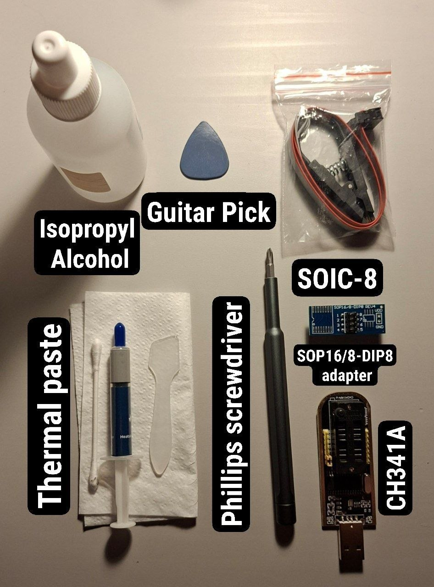
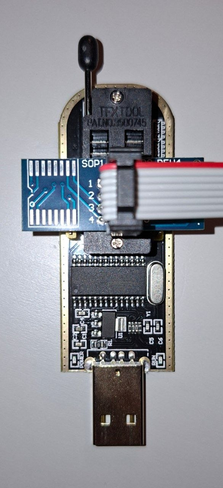
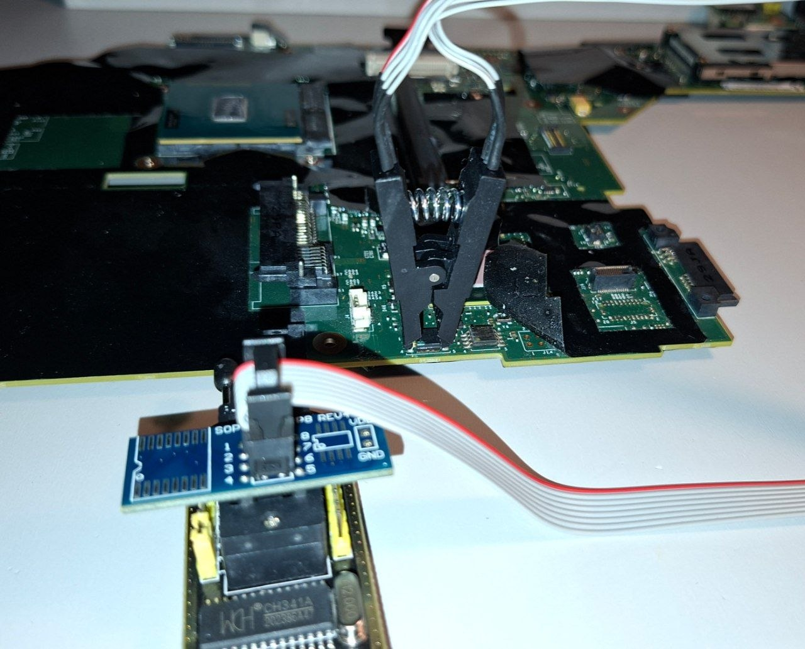

**Part 2: Hardware Disassembly & Flashing Guide**

This guide covers the physical disassembly of the ThinkPad T430 to access its internal flash chips, followed by the external flashing process using a hardware programmer.

## Preparation

### Bill of Materials (BOM)
Before we start, here is the BOM.



## Table of Contents:
* [1. Disassembly](#1-disassembly) (Skip if your laptop is already disassembled.)
* [2. Flashing](#2-flashing) (Jump straight to flashing.)

## 1. Disassembly

#### 1. Turn the laptop over and unscrew the screws as shown in the photo.


#### 2. Open the lid, unscrew the 2 screws holding the keyboard and the 1 screw holding the modem, carefully disconnect the antenna from the module, and remove it.


#### 3. Turn the laptop back over, pry up the keyboard and slide it towards the screen. Be careful — there is a connector under the keyboard. Disconnect it and remove the keyboard.


#### 4. Unscrew the screws holding the palmrest. Now we need a guitar pick — pry up the palmrest and carefully open it, as shown in the photo.


#### 5. Pull it towards yourself. Be careful not to break off the part of the palmrest that goes under the screen. After lifting the freed palmrest, disconnect the touchpad connector and remove the palmrest.


#### 6. Now unscrew all the marked screws and remove the speakers, disconnect the display ribbon cable (1), and disconnect the network card. You can also remove the RAM.


#### 7. After that, disconnect the second display ribbon cable and the USB cover. Also free all the wires going into the display.


#### 8. While holding the display, unscrew the 2 remaining screws and carefully remove it.


#### 9. Now disconnect the power jack cable and the fan cable.


#### 10. Remove the SSD/HDD and, by pressing the ExpressCard dummy slot, remove it from the laptop.


#### 11. Turn the laptop over and, after unlocking, remove the optical drive.


#### 12. Pulling the magnesium roll cage upwards from the left side, remove it from the plastic.


#### 13. Turn the motherboard over and unscrew the screws as shown in the photo. Then, after turning it back over, unscrew the screws holding the cooling system from 4 to 1, little by little. Be careful not to crack the processor, then remove the cooler.


#### 14. Now we can finally remove the cage and access the BIOS chips: U49 (4MB), where the Intel ME is located, and the main U99 (8MB), where the BIOS is located.


## 2. Flashing

#### Preparation

Before starting, we need to install `flashrom`, the utility used for reading, verifying, and writing flash chips.

#### Installing `flashrom`

**Fedora / RHEL:**
```bash
sudo dnf install flashrom
```

**Arch Linux / Artix / EndeavourOS / Manjaro:**
You can install it directly from the official repositories using `pacman`:
```bash
sudo pacman -S flashrom
```

Alternatively, you can use an AUR helper (such as yay or paru) to install it:
```bash
yay -S flashrom
```

**Debian/Ubuntu:**
```bash
sudo apt install flashrom
```

**Void Linux:**
```bash
sudo xbps-install -S flashrom
```

**Alpine:**
```bash
sudo apk add flashrom
```

#### Flash Chips Layout

**As discovered during disassembly, the T430 motherboard houses two separate SPI flash chips located near the magnesium cage boundary:**

- Top Chip (U49): 4MB (32Mbit), contains the Intel Management Engine (ME) firmware.
- Bottom Chip (U99): 8MB (64Mbit), contains the main BIOS/UEFI payload.

Together they form a single 12MB flash space.

#### CRITICAL WARNING:

Before making any modifications, you must take at least 2 independent read dumps of both chips and verify their MD5/SHA256 hashes. If the hashes do not match, do not proceed — it means your test clip connection is unstable.

#### Wiring Diagram (CH341A)

Connect your SOP8/SOIC8 test clip to the hardware programmer. Double-check the Pin 1 marker (usually indicated by a red wire on the ribbon cable and a dot on the chip).




#### Reading the Current Firmware (8MB chip)

1. **Connect the clip to the 8MB (Bottom) chip.**

**Before reading the firmware, change the directory to `SingularN/Dumps`, which was created automatically during the build script.**

```bash

cd Dumps

```

2. **Run the following command to check whether the computer detects our chip:**

```bash

sudo flashrom -p ch341a_spi

```
**If you did everything correctly, the output should be:**

```bash
flashrom v1.6.0 on Linux 7.0.8-200.fc44.x86_64 (x86_64)
flashrom is free software, get the source code at https://flashrom.org
Found Macronix flash chip "MX25L6405" (8192 kB, SPI) on ch341a_spi.
Found Macronix flash chip "MX25L6405D" (8192 kB, SPI) on ch341a_spi.
Found Macronix flash chip "MX25L6406E/MX25L6408E" (8192 kB, SPI) on ch341a_spi.
Found Macronix flash chip "MX25L6436E/NX25L6445E/MX25L6465E" (8192 KB, SPI) on ch341a_spi.
Found Macronix flash chip "MX25L6473E" (8192 kB, SPI) on ch341a_spi.
Found Macronix flash chip "MX25L6473F" (8192 kB, SPI) on ch341a_spi.
Multiple flash chip definitions match the detected chip(s): "MX25L6405", "MX25L6405D", "NX25L6406E/MX25L6408E", "MX25L6436E/MX25L6445E/MX25 L6465E", "MX25L6473E", "MX25L6473F"

Please specify which chip definition to use with the -c <chipname> option.
```

**NOTES**

**Note №1:** The exact chip model may vary depending on your laptop's manufacturing date. In my case, it was a **MX25L6406E/MX25L6408E** and **MX25L3205D/MX25L3208D**

**Note №2:** Troubleshooting: Write Protection Error

Sometimes, when attempting to erase or write to the chip, flashrom may throw an error stating that the memory is write-protected (due to block protection bits BP0–BP2 active in the status register). While the chips on the T430 are not hardware-locked via the physical WP# pin, software protection flags inside the chip itself can sometimes be left enabled.

1. Check the current protection status:
   ```bash
   
   flashrom -p ch341a_spi --wp-status
   
   ```
If the utility shows that protection is enabled or a protected range (wp-range) is specified, it needs to be disabled.

2. Disable the write protection if it's enabled:
   ```bash
   
   flashrom -p ch341a_spi --wp-disable
   
   ```


4. **After confirming that the computer detects our chip, we can create dumps 1 and 2:**

```bash

sudo flashrom -p ch341a_spi -c MX25L6406E/MX25L6408E -r 8MB-1-dump.bin

```

```bash

sudo flashrom -p ch341a_spi -c MX25L6406E/MX25L6408E -r 8MB-2-dump.bin

```

4. **Checking the checksums:**

```bash

sha256sum 8MB-1-dump.bin 8MB-2-dump.bin

```

**If the connection is good, they will be EXACTLY the same.**
(Mine and yours will differ because I am not flashing for the first time.)

```bash
d327997fcea1a1fd623859d4bd61570552d1177e0538e4d274b4fc3d46495bff 8MB-1-dump.bin
d327997fceala1fd623859d4bd61570552d1177e0538e4d274b4fc3d46495bff 8MB-2-dump.bin
```

**!!! If the hashes do not match, do not proceed — it means your test clip connection is unstable !!!**

Also, do not delete these dumps. If something goes wrong, they will be the only way to restore functionality.

#### Flashing (8MB chip)

**Before flashing the firmware, change the directory to `SingularN/SingularN-roms`, which was created automatically during the build script.**

```bash

cd ..
cd SingularN-roms

```

**Run the following command to flash it:**

```bash

sudo flashrom -p ch341a_spi -c MX25L6406E/MX25L6408E -w SingularN-T430-v3.0.0-BOTTOM-8MB.rom

```

**The output should be:**

```bash

flashrom v1.6.0 on Linux 7.0.8-200.fc44.x86_64 (x86_64)
flashrom is free software, get the source code at https://flashrom.org
Found Macronix flash chip "MX25L6406E/MX25L6408E" (8192 kB, SPI) on ch341a_spi.
Reading old flash chip contents... done.
Updating flash chip contents... Erase/write done from 0 to 7fffff
Verifying flash... VERIFIED.

```

**Once more: if it is NOT VERIFIED, check the connection and reflash!**

#### Reading the Current Firmware (4MB chip)

1. **Connect the clip to the 4MB (Top) chip.**

**Before reading the firmware, change the directory to `SingularN/Dumps`, which was created automatically during the build script.**

```bash

cd ..
cd Dumps

```

2. **Run the following command to check whether the computer detects our chip:**

```bash

sudo flashrom -p ch341a_spi

```
**If you did everything correctly, the output should be:**

```bash

flashrom v1.6.0 on Linux 7.0.8-200.fc44.x86_64 (x86_64)
flashrom is free software, get the source code at https://flashrom.org
Found Macronix flash chip "MX25L3205(A)" (4096 kB, SPI) on ch341a_spi.
Found Macronix flash chip "MX25L3205D/MX25L3208D" (4096 kB, SPI) on ch341a_spi. Found Macronix flash chip "MX25L3206E/MX25L3208E" (4096 kB, SPI) on ch341a_spi.
Found Macronix flash chip "MX25L3273F" (4096 kB, SPI) on ch341a_spi.
Found Macronix flash chip "MX25L3233F/MX25L3273E" (4096 kB, SPI) on ch341a_spi.
Multiple flash chip definitions match the detected chip(s): "MX25L3205(A)", "MX25L3205D/MX25L3208D", "MX25L3206E/MX25L3208E", "MX25L3273F", MX25L3233F/MX25L3273E" 

Please specify which chip definition to use with the -c <chipname> option.

```

**Note:** The exact chip model may vary depending on your laptop's manufacturing date. In my case, it was a **MX25L3205D/MX25L3208D**.

3. **After confirming that the computer detects our chip, we can create dumps 1 and 2:**

```bash

sudo flashrom -p ch341a_spi -c MX25L3205D/MX25L3208D -r 4MB-1-dump.bin

```

```bash

sudo flashrom -p ch341a_spi -c MX25L3205D/MX25L3208D -r 4MB-2-dump.bin

```

4. **Checking the checksums:**

```bash

sha256sum 4MB-1-dump.bin 4MB-2-dump.bin

```

**If the connection is good, they will be EXACTLY the same.**
(Mine and yours will differ because I am not flashing for the first time.)

```bash
431c55816d20b1bc2b8cea875daf72a35ee54fccc2a89e1066d8b59cf00c4fce 4MB-1-dump.bin
431c55816d20b1bc2b8cea875daf72a35ee54fccc2a89e1066d8b59cf00c4fce 4MB-2-dump.bin
```

**!!! If the hashes do not match, do not proceed — it means your test clip connection is unstable !!!**

Also, do not delete these dumps. If something goes wrong, they will be the only way to restore functionality.

#### Flashing (4MB chip)

**Before flashing the firmware, change the directory to `SingularN/SingularN-roms`, which was created automatically during the build script.**

```bash

cd ..
cd SingularN-roms

```

**Run the following command to flash it:**

```bash

sudo flashrom -p ch341a_spi -c MX25L3205D/MX25L32080 -w SingularN-T430-v3.0.0-TOP-4MB.rom

```

**The output should be:**

```bash

flashrom v1.6.0 on Linux 7.0.8-200.fc44.x86_64 (x86_64) flashrom is free software, get the source code at https://flashrom.org
Found Macronix flash chip "MX25L3205D/MX25L32080" (4096 kB, SPI) on ch341a_spi.
This flash part has status UNTESTED for operations: WP
The test status of this chip may have been updated in the latest development version of flashrom. If you are running the latest development version, please email a report to flashrom@flashrom.org if any of the above operations work correctly for you with this flash chip. Please include the flashrom log file for all operations you tested (see the man page for details), and mention which mainboard or programmer you tested in the subject line.
You can also try to follow the instructions here: https://www.flashrom.org/contrib_howtos/how_to_mark_chip_tested.html
Thanks for your help!
Reading old flash chip contents... done.
Updating flash chip contents... Erase/write done from 0 to 3fffff
Verifying flash... VERIFIED.
```

**Once more: if it is NOT VERIFIED, check the connection and reflash!**

## And that's it! Now you can assemble and test it! I hope this guide helped you, and thank you for using SingularN!

```ASCII ART

############################################################
#                                                          #
#    .d888           .d8888b.                    888 888   #
#   d88P"           d88P  Y88b                   888 888   #
#   888                    888                   888 888   #
#   888888 888  888      .d88P 88888b.  888  888 888 888   #
#   888    `Y8bd8P'  .od888P"  888 "88b 888  888 888 888   #
#   888      X88K    d88P"     888  888 888  888 888 888   #
#   888    .d8""8b. 888"       888  888 Y88b 888 888 888   #
#   888    888  888 888888888  888  888  "Y88888 888 888   #
#                                                          #
############################################################
#          Heads Hardened Firmware for T430                #
############################################################

```
